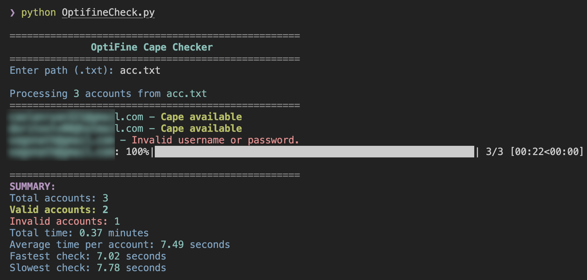

# Optifine Checker


A tool to check if OptiFine accounts have capes associated with them. This script automates the process of logging into OptiFine accounts and checking for cape availability.

The code uses DrissionPage for browser automation, which is a lightweight alternative to Selenium. It also includes a Cloudflare bypasser to handle protection challenges.

## Requirements

- Python 3.6+
- Google Chrome browser installed
- Required Python packages (see requirements.txt)

## Installation

1. Clone this repository:
   ```
   git clone https://github.com/rasyachremony/Optifine-Checker/
   cd optifine-cape-checker
   ```

2. Install the required dependencies:
   ```
   pip install -r requirements.txt
   ```

3. Make sure you have Google Chrome / Chromium installed on your system.

## Usage

1. Create a text file containing OptiFine accounts in the format `email:password`, with one account per line.

2. Run the script:
   ```
   python cape.py
   ```

3. When prompted, enter the path to your accounts file.
   ```
   acc.txt
   ```

5. The script will process each account and display results in real-time.

6. Results will be saved in the `results` folder:
   - `with_cape.txt`: Accounts that have capes
   - `error_accounts.txt`: Accounts with errors or no capes

## Contribute
Please feel free to enhance this further for greater efficiency and push the changes to Git.

## License

This project is licensed under the MIT License - see the LICENSE file for details.

## Disclaimer

This tool is for educational and experimental purposes only. Use it responsibly with OptiFine's terms of service. 
